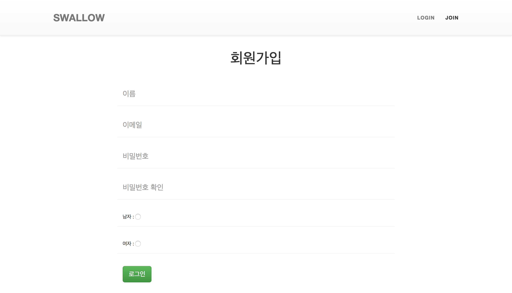
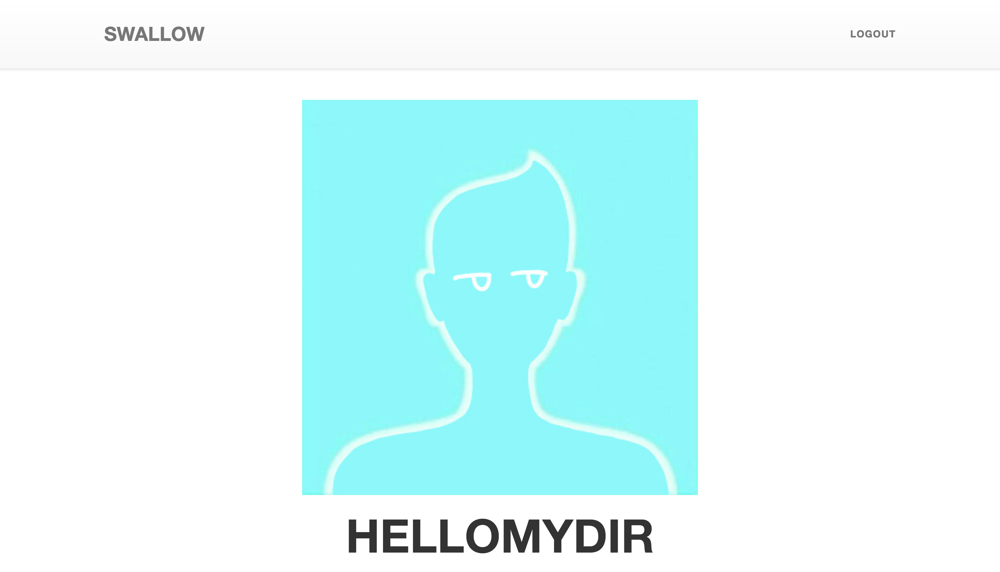
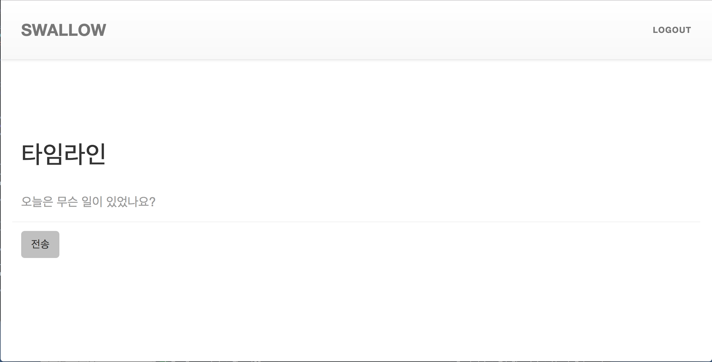
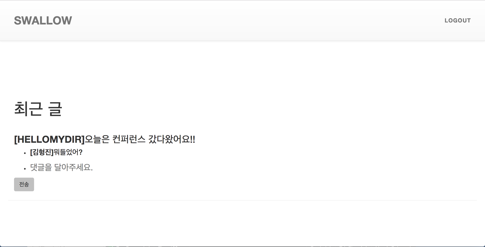

# README

This README would normally document whatever steps are necessary to get the
application up and running.

Things you may want to cover:

* ruby 2.3.1p112

* Rails 5.0.0.1

* Gem version : 2.5.1

### Preview

#### main page

#### login page

#### join page

#### user info

#### timeline input

#### timeline

